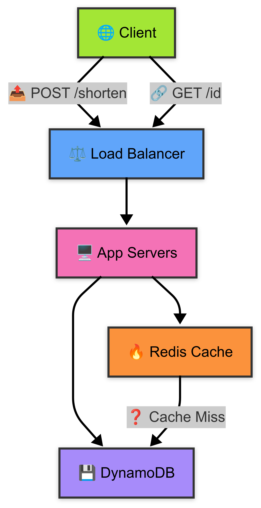

# Design a URL Shortener (v1)

## Requirements
- **Functional**:
  - Shorten URLs to 7-character IDs.
  - Redirect short URLs to original URLs.
  - Support custom aliases (optional).
- **Non-functional**:
  - Handle 1M shorten requests/day (~11 requests/sec).
  - 99.9% uptime.
  - Low latency redirects (<100ms).

## Architecture
- **API**:
  - `POST /shorten`: Input long URL, optional alias; returns short URL.
  - `GET /{id}`: Redirect to long URL.
- **Components**:
  - Load Balancer: Distributes traffic.
  - App Servers: Handle API logic.
  - Database: NoSQL (DynamoDB) for key-value storage (short ID → long URL).
  - Cache: Redis for hot URLs to reduce DB load.
- **Data Flow**:
  1. Client sends long URL.
  2. App generates Base62 ID (or uses alias).
  3. Store ID → URL mapping in DB and cache.
  4. Return short URL (e.g., `https://short.ly/abc1234`).

## Diagram

## Trade-offs
- **ID Generation**: Base62 (a-z, A-Z, 0-9) vs. hash (MD5). Chose Base62 for predictable length and no collisions.
- **DB Choice**: SQL vs. NoSQL. Picked DynamoDB for scalability and simple key-value needs.
- **Cache**: Redis vs. Memcached. Redis for persistence and speed.

## Scalability
- **Traffic**: 1M/day = ~11 req/sec. Single server handles ~1K req/sec, so 2-3 servers suffice.
- **Storage**: 1M URLs at 1KB each = 1GB. DynamoDB scales automatically.
- **Cache**: Store 10K hot URLs in Redis (~10MB).

## Next Steps
- Add rate limiting to prevent abuse.
- Explore consistent hashing for DB sharding.
- Design analytics for click tracking.